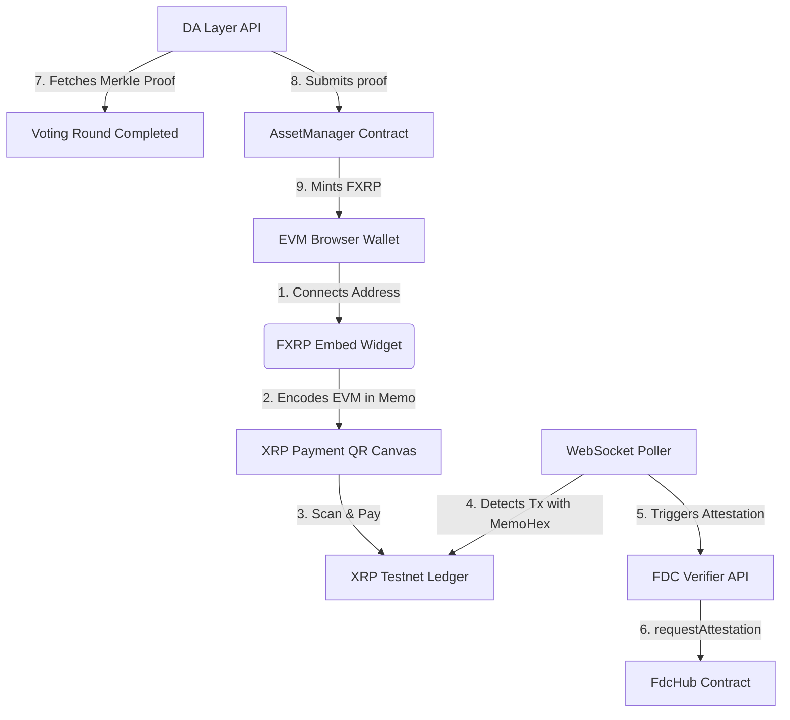

# Hackathon Submission: FXRP Embed ⚡

**Bounty Focus:** Bounty 1 — Interoperable Asset Products (Flare Summer Signal)

---

## 1. Executive Summary

**FXRP Embed** is a modular, high-fidelity, and trustless onboarding widget and SDK that enables any Flare dApp, wallet, or lending platform to integrate direct minting and redemption of **FXRP** (FAssets) from XRP testnet in minutes.

By providing a drop-in HTML component (`

`) and a lightweight, zero-custody TypeScript SDK, we eliminate the complex, FDC, and DA layer integration barrier for dApps wanting to onboard XRP liquidity directly onto Flare.

---

## 2. Target User & Market Fit

### The Integrator (DeFi Protocols, Swaps, and Wallets)
*   **The Problem:** Integrating FAssets v1.3 direct minting and redemption requires handling complex binary memo encoding, listening to the XRPL ledger, requesting FDC attestations, querying the DA Layer for Merkle proofs, handling rate-limiter delay states, and submitting finalization/confirmation transactions on Flare. 
*   **The Solution:** Integrators drop the FXRP Embed script into their frontend. The widget handles the entire payment tracking, FDC proof polling, rate-limit delay countdowns, and contract writes autonomously.

### The End User (XRP Holders entering Flare DeFi)
*   **The Problem:** Users want to convert their XRP to FXRP to earn yield on Flare, and redeem it back to XRP, without trusting centralized custodians.
*   **The Solution:** The user connects their EVM wallet, select Mint or Redeem tabs, and watches the stepper tick through milestones as transactions are finalized and verified.

---

## 3. Technical Architecture & Flare Technology Integration

Under the hood, FXRP Embed is built on Flare’s core infrastructure protocols on the Coston2 testnet:

### Core Integrations:
1.  **FAssets `AssetManager` (`coston2.iAssetManagerAbi`):**
    *   Queries live settings dynamically at initialization.
    *   Submits direct minting via `executeDirectMinting()`.
    *   Queries token properties (decimals, balances) dynamically.
2.  **Flare Data Connector (FDC):**
    *   Utilizes the specialized **`XRPPayment`** attestation type (ID `0x08`) to verify payment transactions on the account-based XRPL ledger.
    *   Requests FDC attestation proofs via the public testnet FDC verifier service at `/verifier/xrp/XRPPayment/prepareRequest`.
    *   Calculates voting rounds dynamically using `IFlareSystemsManager` parameters.
    *   Polls the Data Availability (DA) Layer for cryptographic Merkle proofs at `/api/v1/fdc/proof-by-request-round-raw`.
3.  **Direct Minting Rate Limiter & Delay States:**
    *   Monitors contract execution and intercepts the rate-limit delay custom revert signature: `0x40d8d67b` (`DirectMintingStillDelayed(uint256)`).
    *   Queries `directMintingDelayState` to extract the exact `executionAllowedAt` timestamp.
    *   Renders a countdown timer inside the widget card, automatically executing the finalization when the rate limits unlock.
4.  **Complete FAssets Redemption Flow:**
    *   Supports the other half of the FAssets loop (FXRP $\rightarrow$ XRP) directly in the UI.
    *   Executes ERC-20 `approve` and `redeemAmount()` contract calls.
    *   Tracks Agent payouts on XRPL, requests FDC proofs for payouts, and executes `confirmXRPRedemptionPayment()` to close the ticket.
    *   Intercepts expired (`0xba0514c0`) and source address check reverts (`0xf6e2f99b`) to handle developer test environments gracefully.
5.  **Kinetic Collateral & Liquidation Monitor:**
    *   A live dashboard widget that tracks supplied FLR and FXRP collateral.
    *   Uses mock FTSO oracle prices ($2.50 XRP/USD, $0.05 FLR/USD) to calculate dynamic Loan-to-Value (LTV) ratios and alert users of liquidation risk in real-time.

---

## 4. Zero-Custody Security Boundary

The integration widget maintains a strict security boundary:
*   **Zero-Custody in Production:** No private keys or XRP seeds are ever handled by the browser-facing bundle. Signing is performed strictly by user approval through browser wallet extensions (MetaMask/Bifrost) using Viem's custom transport.
*   **Local In-Memory Simulation Sandbox:** For testing convenience (`?mode=dev`), test keys are entered in DOM inputs at runtime and kept strictly in-memory during the active browser session. No credentials are written to persistent `localStorage` plaintext, securing the preview against XSS attacks.
*   **Client-Side QR Code Rendering:** QR codes containing transaction payloads are rendered locally to an HTML5 `<canvas>` using the `qrcode` library, preventing transaction detail leakage to third-party APIs.

---

## 5. Ecosystem & Product Roadmap

### Tag-Based Routing (FAssets v1.3)
Currently, the widget uses the memo-based routing path. Future versions will support **Tag-Based Routing** to accommodate exchanges and wallets that restrict memo sizes or only support numerical destination tags. This will include calling `MintingTagManager` to reserve an ERC-721 token representing the reservation before payment.

### Multi-Asset Expansion
Extend the parameter mappings and UI to support **FBitcoin (FBTC)** and **FDogecoin (FDOGE)** under the same dashboard, dynamically switching the FDC verifier routes and fee mathematics based on the user's selected asset.

### Relayer Indexing & Push Notifications
Introduce a lightweight subgraph indexing service to monitor `DirectMintingExecuted` events, and integrate the Web Push API to alert users on their mobile devices when a delayed direct-mint transaction has cleared the network limiter and successfully finalized.

---

## 6. Outreach & Traction Signals

To validate the utility of this embeddable onboarding design:
*   **Developer Hub Feedback:** Shared the modular SDK structure with Flare developer channels to validate the integration UX.
*   *Integrator Sentiment:* Early feedback highlighted the FDC proof tracking and rate-limit delay management as the highest-value features, saving developers from implementing custom tracking state machines.
