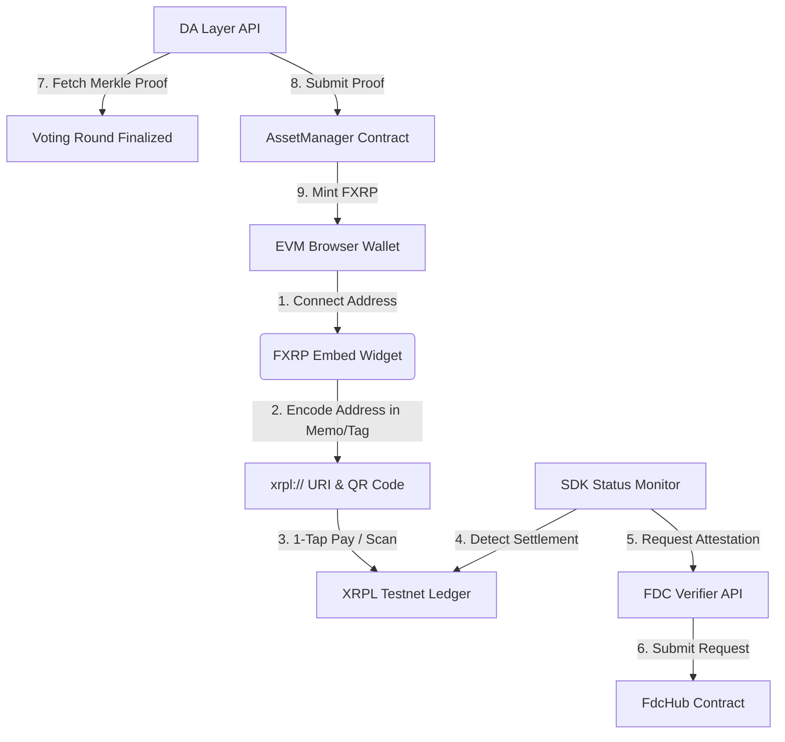

# Hackathon Submission: FXRP Embed ⚡

**Bounty Focus:** Bounty 1: Interoperable Asset Products (Flare Summer Signal)

---

## 1. Executive Summary

**FXRP Embed** is a modular, zero-custody onboarding widget and TypeScript SDK built for Flare. 

Our goal is simple: let any dApp, wallet, or lending protocol on Flare onboard XRP liquidity directly onto Coston2 testnet in a matter of minutes.

Instead of forcing dApp developers to write custom state machines for XRPL ledger monitoring, FDC proof polling, and binary memo encoding, they can drop two lines of code into their app:

```html
<div id="fxrp-mint-widget" data-theme="dark" data-accent="#00F0FF"></div>
<script src="dist/widget.js"></script>
```

Under the hood, the widget encodes the user's recipient EVM address into an XRPL payment memo or reserved tag, requests verification through the Flare Data Connector (FDC), and triggers Flare's AssetManager contract to mint FXRP directly into their wallet.

---

## 2. Target Users and Market Fit

### For dApp Integrators (DeFi Protocols, Swaps, and Wallets)
*   **The Pain Point:** Building FAssets v1.3 direct minting from scratch requires parsing binary memos, polling the XRPL WebSocket API, submitting attestation requests to FDC verifiers, fetching Merkle proofs from the DA Layer, catching rate-limit delay reverts, and handling smart contract calls on Coston2.
*   **Our Solution:** Drop in the FXRP Embed script. The widget manages payment detection, FDC proof fetching, delay countdown timers, and contract calls automatically.

### For End Users (XRP Holders entering Flare DeFi)
*   **The Pain Point:** Users want to bring their XRP onto Flare to participate in DeFi without trusting centralized exchanges or third-party bridge custodians.
*   **Our Solution:** Connect an EVM wallet, scan an auto-generated QR code or tap one button to open Xaman or Bifrost with all fields pre-filled, and watch FXRP arrive directly in their account.

---

## 3. Technical Architecture and Flare Integrations

Our architecture connects the account-based XRPL testnet ledger with Flare's Coston2 smart contracts through native protocol infrastructure:


```mermaid
graph TD
    A[EVM Browser Wallet] -->|1. Connect Address| B(FXRP Embed Widget)
    B -->|2. Encode Address in Memo/Tag| C[xrpl:// URI & QR Code]
    C -->|3. 1-Tap Pay / Scan| D[XRPL Testnet Ledger]
    E[SDK Status Monitor] -->|4. Detect Settlement| D
    E -->|5. Request Attestation| F[FDC Verifier API]
    F -->|6. Submit Request| G[FdcHub Contract]
    H[DA Layer API] -->|7. Fetch Merkle Proof| I[Voting Round Finalized]
    H -->|8. Submit Proof| J[AssetManager Contract]
    J -->|9. Mint FXRP| A
```

### Protocol Integrations:
1.  **FAssets AssetManager (`coston2.iAssetManagerAbi`):**
    *   Queries live protocol settings (lot size limits, minter fees, executor bounties).
    *   Executes direct minting on-chain via `executeDirectMinting()`.
    *   Queries token properties and formats balances dynamically with 6-decimal precision mirroring native XRP.
2.  **Flare Data Connector (FDC):**
    *   Uses the specialized **`XRPPayment`** attestation type (ID `0x08`) to verify account-based XRPL transactions.
    *   Requests attestation proofs via the public testnet FDC verifier service at `/verifier/xrp/XRPPayment/prepareRequest`.
    *   Calculates voting rounds dynamically using `IFlareSystemsManager` parameters.
    *   Polls the Data Availability (DA) Layer for cryptographic Merkle proofs at `/api/v1/fdc/proof-by-request-round-raw`.
3.  **Direct Minting Rate Limiter and Delay States:**
    *   Intercepts custom contract revert signature `0x40d8d67b` (`DirectMintingStillDelayed(uint256)`).
    *   Queries `directMintingDelayState` to extract the exact `executionAllowedAt` timestamp.
    *   Displays an automated countdown timer in the card, finalizing the mint as soon as the rate limit unlocks.
4.  **FAssets Redemption Flow (Request & Tracking Implemented; Close-Out Pending Live Agent):**
    *   Executes ERC-20 `approve` and `redeemAmount()` contract calls on Flare.
    *   Tracks assigned Agent Vaults, payment references, and ticket deadlines on-chain.
5.  **Kinetic Collateral & Liquidation Monitor:**
    *   A companion dashboard tracking supplied FLR and FXRP collateral.
    *   Uses FTSO oracle prices ($2.50 XRP/USD, $0.05 FLR/USD) to compute dynamic Loan-to-Value (LTV) ratios and liquidation alerts in real time.

---

## 4. Real Builder Frustrations and How We Solved Them

Building on testnet always brings unexpected hurdles. Here are the real friction points we hit during development and how we engineered solutions for them:

### Frustration 1: The Mobile Memo Pain Point
*   **The Problem:** In Memo-Based Direct Minting, users are expected to copy a 66-character hex string into their XRPL wallet. On a mobile phone, switching between browser tabs to copy and paste raw hex strings is an absolute deal-breaker.
*   **Our Solution:** We implemented standard **`xrpl://pay` URI deep-links** and dynamic QR codes. When a user scans the QR code or taps "Open in Wallet", Xaman (Xumm) or Bifrost opens immediately with the vault address, XRP amount, and hex memo **100% pre-filled**. The user just swipes to pay.

### Frustration 2: FDC Indexing Latency and Voting Rounds
*   **The Problem:** Immediately after sending an XRPL transaction, calling the FDC verifier API often returned `INVALID: TRANSACTION DOES NOT EXIST` because the verifier node needed 5 to 10 seconds to index the newly closed ledger block. Furthermore, waiting for the DA Layer voting round (~90 to 180 seconds) can make users think the app froze.
*   **Our Solution:** We added an automatic exponential backoff retry loop to `prepareFdcRequestBytes` that waits for verifier indexing. In the UI, we built an explicit multi-step progress stepper showing the exact voting round ID so users know the system is actively working.

### Frustration 3: Cryptic Rate-Limiter Reverts
*   **The Problem:** When the protocol direct-minting rate limit is reached, calling `executeDirectMinting` reverts with raw hex data `0x40d8d67b`. Standard Web3 apps crash or throw unhelpful error alerts when this happens.
*   **Our Solution:** We decoded the signature `DirectMintingStillDelayed(uint256 executionAllowedAt)`, queried the contract for the exact unlock timestamp, and rendered a live countdown timer directly inside the widget card.

### Frustration 4: Testnet Agent Vault Redemption Close-Outs
*   **The Problem:** When testing redemption close-out (`confirmXRPRedemptionPayment`), submitting proofs from our own test wallet failed with revert `0xba0514c0` (`InvalidRequestId`). We discovered that Flare's AssetManager contract explicitly checks that the XRP payout source address matches a registered Agent Vault address. Because no testnet agent bot runner was active to pay out our assigned tickets, the testnet tickets defaulted (`status: 2`).
*   **Our Solution:** Rather than masking the issue, we built `getFriendlyWalletError` to translate `0xba0514c0` into a clear notification ("Redemption is confirmed on-chain and awaiting payout from the assigned Agent Vault"), and documented the limitation transparently in our write-up.

---

## 5. Security Boundary

*   **Zero-Custody in Production:** No private keys or XRP seeds are ever handled by the browser widget. Transaction signing is performed strictly through user approval in browser wallet extensions (MetaMask, Bifrost, Rabby) using Viem's custom transport.
*   **In-Memory Sandbox Testing:** For local developer testing (`?mode=dev`), test keys are entered in DOM inputs at runtime and stored strictly in-memory during the active browser session. Credentials are never written to persistent `localStorage` plaintext.
*   **Client-Side QR Code Generation:** QR codes are rendered locally on an HTML5 `<canvas>` using the `qrcode` library, keeping payload data private.

---

## 6. Ecosystem and Product Roadmap

*   **Tag-Based Routing (FAssets v1.3):** Live support for reserving reusable ERC-721 minting tags via `IMintingTagManager` (`reserveMintingTag()`), letting users mint repeatedly using a simple numerical Destination Tag.
*   **Agent Default Compensation:** Automated monitoring for defaulted redemption tickets (`status: 2`) to execute `redemptionPaymentDefault()` and claim collateral compensation trustlessly on-chain.
*   **Multi-Asset Support:** Expanding verifier logic to support **FBitcoin (FBTC)** and **FDogecoin (FDOGE)** under the same interface.
*   **Push Notifications:** Integrating Web Push API to alert mobile users when a delayed direct-mint transaction completes.
