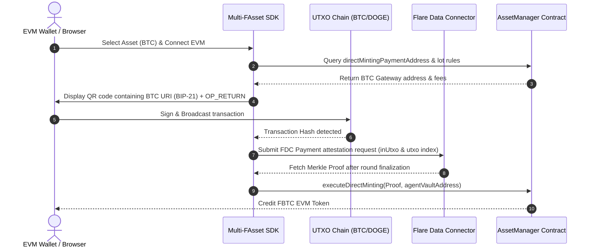

# FAssets Multi-Chain Expansion Architecture (FBTC, FDOGE, FLTC) ⚡

This directory contains the core architecture, SDK implementation, and UI controller models for expanding **FXRP Embed** to support other Flare- enshrining assets (**FBTC**, **FDOGE**, and **FLTC**) on the Coston2 testnet.

---

## 1. Multi-Chain Direct Minting Mechanism

While XRP is account-based, Bitcoin (BTC), Dogecoin (DOGE), and Litecoin (LTC) are UTXO-based. This requires different formatting and validation pipelines.

```
       +-----------------------------------------------------------+
       |                  UTXO Transaction Structure               |
       +-----------------------------------------------------------+
       |  Inputs:   [User's BTC Wallet inputs...]                  |
       +-----------------------------------------------------------+
       |  Outputs:  Output 0: BTC directMintingAddress (Amount)     |
       |            Output 1: OP_RETURN (32-byte Binary Memo)      |
       +-----------------------------------------------------------+
```

### A. OP_RETURN Binary Memo Payload
Instead of Ripple's `Memos` field, UTXO payments encode the recipient EVM address inside a standard **`OP_RETURN`** output script.
*   **Format:** `OP_RETURN` + `0x18` (Data size: 24 bytes) + `DIRECT_MINTING Prefix (8 bytes)` + `Recipient EVM Address (20 bytes)`
*   **Prefix:** `4642505266410018`
*   **Total Payload (64 hex characters):** `464250526641001800000000[20-byte recipient EVM address]`

### B. Dynamic AssetManager Resolution
Each FAsset has its own independent `AssetManager` contract registered under the Coston2 Contract Registry.
*   `AssetManagerXRP` $\rightarrow$ `AssetManagerXRP`
*   `AssetManagerBTC` $\rightarrow$ `AssetManagerBTC`
*   `AssetManagerDOGE` $\rightarrow$ `AssetManagerDOGE`

---

## 2. FDC Attestation Mapping (Payment Type `0x02`)

While XRP uses `XRPPayment` (Attestation ID `0x08`), UTXO blockchains use the generic FDC **`Payment`** attestation type (ID `0x02`).

### Verifier Request Body Comparison

#### XRP (`XRPPayment`)
Account-based transaction tracking is straightforward:
```json
{
  "attestationType": "0x0000000000000008",
  "sourceId": "testXRP",
  "requestBody": {
    "transactionId": "0x[32-byte XRPL Payment Hash]",
    "proofOwner": "0x[EVM Address]"
  }
}
```

#### BTC / DOGE (`Payment`)
UTXO tracking requires specifying input/output indexes since a single transaction contains multiple inputs and outputs:
```json
{
  "attestationType": "0x0000000000000002",
  "sourceId": "testBTC",
  "requestBody": {
    "transactionId": "0x[32-byte Bitcoin Tx Hash]",
    "inUtxo": "0",
    "utxo": "0"
  }
}
```
*   `inUtxo`: Index of the transaction input used (typically `0`).
*   `utxo`: Index of the transaction output sent to the registered `directMintingPaymentAddress` (typically `0` or `1`, depending on change layouts).

---

## 3. Workflow Steps for UTXO FAsset Onboarding


